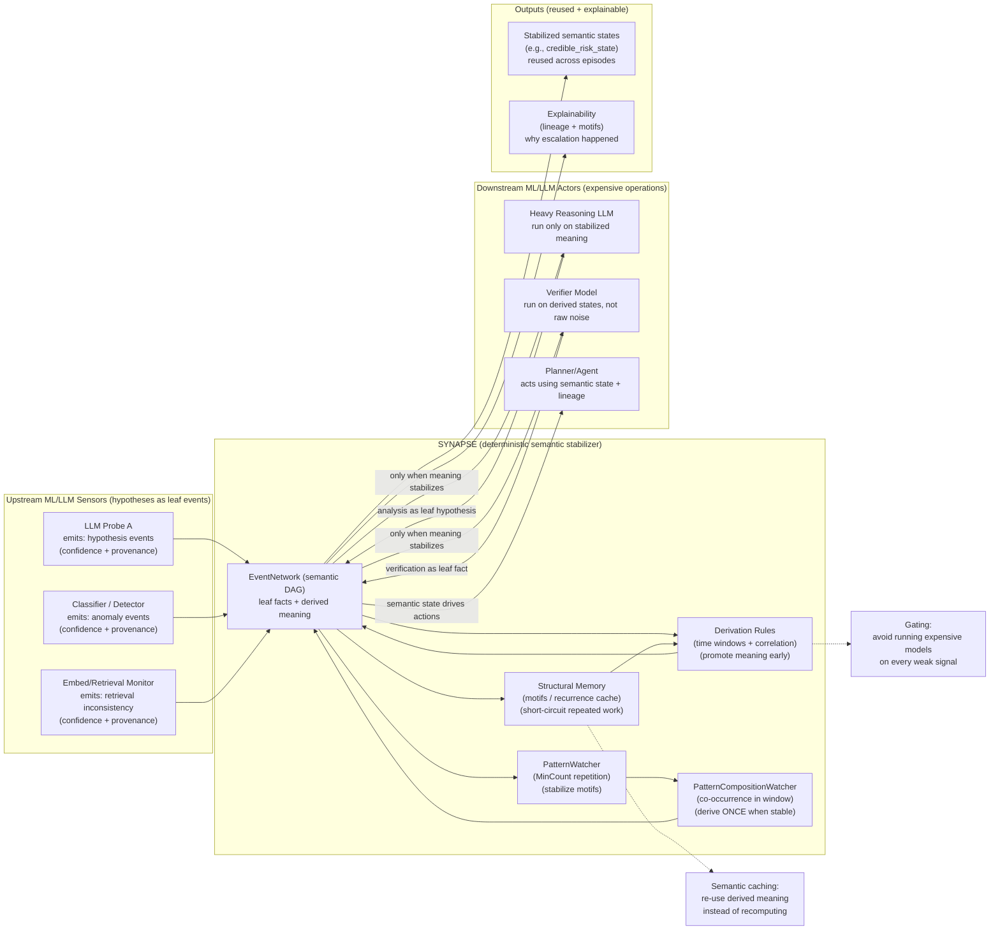

# SYNAPSE Between ML/LLM Layers

## Deterministic Semantic Orchestration for Faster, Partially-Deterministic AI Systems

> *Models hypothesize. SYNAPSE stabilizes. Models act.*

---

## Problem: Multi-Model AI Pipelines Waste Work

Modern AI products increasingly resemble *pipelines of models*:

* a lightweight classifier gates a heavy LLM,
* an embedding search retrieves candidates for a reasoning model,
* a verifier model re-checks outputs,
* a policy model evaluates safety constraints,
* a monitor model watches telemetry and user feedback.

In practice, these pipelines often waste operations because they lack a persistent semantic memory of “what is already known”:

* repeated inputs cause repeated expensive inference,
* the system re-evaluates the same weak signals,
* downstream steps run even when evidence is insufficient,
* decision logic becomes ad-hoc and hard to explain.

The result is slower systems, higher cost, and brittle behavior under drift.

---

## SYNAPSE’s Role: Deterministic Semantic Stabilization Between Models

SYNAPSE is not another model layer. It is a **deterministic semantic substrate** that sits *between* model layers and converts noisy signals into stable meaning.

### Two strict roles

1. **ML/LLM layers produce hypotheses**

   * emitted as *leaf events*
   * include provenance and confidence
   * may be wrong or incomplete

2. **SYNAPSE promotes hypotheses into meaning**

   * deterministic, time-windowed derivation
   * cross-signal corroboration
   * stabilization via repeated motifs / pattern composition
   * persistent lineage and explainability

This creates a partially deterministic system:

* probabilistic at the edges (sensors/models)
* deterministic in the middle (semantic promotion and orchestration)

---

## Reference Architecture: Layered AI With SYNAPSE In the Middle

### Conceptual flow

```
[ ML/LLM Sensors ]  ->  leaf events (hypotheses)
          |
          v
[ SYNAPSE EventNetwork ]
  - deterministic derivation
  - time windows
  - recurrence stabilization
  - semantic memory
          |
          v
[ Downstream ML/LLM Actors ]
  - reasoning / planning
  - generation
  - verification
  - governance actions
```

### A practical interpretation

* Upstream models = “semantic sensors”
* Downstream models = “semantic actors”
* SYNAPSE = “semantic stabilizer + memory”

---

## Why This Reduces Operations and Speeds Up AI Systems

SYNAPSE reduces compute and latency via **semantic gating** and **semantic caching**, not by making models faster.

### 1. Semantic gating (do less work)

Downstream expensive operations are triggered only when meaning stabilizes.

Example gating rule:

* do not call heavy reasoning model on every “possible issue”
* call it only when:

  * the hypothesis repeats in a time window, OR
  * multiple independent sensors corroborate, OR
  * a pattern composition indicates stable emergence

This prevents “panic inference” where every weak signal triggers the entire pipeline.

### 2. Semantic caching (don’t repeat work)

SYNAPSE persists derived meaning as first-class events.

If the same semantic situation repeats:

* the system does not recompute the same multi-step inference chain
* it reuses a derived semantic state already in the EventNetwork
* it escalates only if repetition indicates evolution or worsening

This shifts the system from **stateless inference** to **stateful meaning re-use**.

### 3. Pattern stabilization (ignore noise, promote structure)

Many ML signals are transient or inconsistent.

SYNAPSE’s pattern layer can require:

* MinCount repetitions before promoting meaning
* a composition of multiple stable motifs before triggering actions

This reduces expensive false positives and the follow-on work they cause (secondary inference, human review, incident response).

### 4. Early termination and short-circuiting

Once stable meaning is present:

* entire branches of the pipeline can be skipped
* actor models can query the EventNetwork and decide “no action needed”
* the system avoids re-running evaluation loops for already-resolved situations

---

## The “Partially Deterministic AI” Contract

A system becomes partially deterministic when:

* probabilistic components only generate **leaf hypotheses**
* deterministic rules/patterns define when hypotheses become **semantic facts**
* all escalations are explainable as graph lineage and motifs

This yields a clean contract:

### What models may do

* produce candidate signals with confidence
* propose explanations as text (optional)
* propose new candidate PatternSpecs (optional)

### What SYNAPSE guarantees

* deterministic, replayable promotion of meaning
* time-windowed correlation rules
* structural memory of repeated derivations
* explicit stabilization thresholds (MinCount / composition)
* explainability via ancestry (contributors → derived state)

### What models must not do (in this architecture)

* silently trigger irreversible decisions
* replace semantic promotion rules with hidden heuristics
* mutate derived meaning post-hoc

---

## Canonical Layer Roles

### Semantic sensors (upstream ML/LLM)

Emit leaf events:

* `llm_misuse_hypothesis`
* `policy_conflict_hypothesis`
* `semantic_anomaly_detected`
* `retrieval_inconsistency_detected`
* `alignment_tension_detected`

Each includes provenance:

* `sensor_id`, `confidence`, evidence pointers/hashes

### Semantic stabilizer (SYNAPSE)

Derives and stabilizes:

* `hypothesis_clustered`
* `cross_domain_corroborated_signal`
* `credible_risk_state`
* `governance_action_required`
* `research_debug_session_required`

### Semantic actors (downstream ML/LLM)

Consume stabilized meaning:

* decide next best action
* generate human-readable analysis
* plan mitigation steps
* propose experiments or eval suites
* verify outputs under the stabilized context

---

## Example: Two LLMs + One Classifier + SYNAPSE

A minimal but realistic pipeline:

1. **LLM A (Intent/Policy probe)** emits `llm_policy_tension_hypothesis`
2. **Classifier (Telemetry anomaly)** emits `behavior_shift_detected`
3. **LLM B (Explanation agent)** is expensive; only run when SYNAPSE stabilizes meaning

SYNAPSE:

* clusters repeating hypotheses into `tension_cluster`
* correlates with behavior shift within a window → `credible_drift_signal`
* only then triggers downstream LLM B for a full analysis summary
* if the drift motif repeats across runs → promotes `research_debug_session_required`

Outcome:

* expensive model runs occur *only* after stabilization
* repeated weak signals do not repeatedly trigger the full chain
* final escalations are structurally justified

---

## What Makes This Novel in Practice

Many systems use:

* thresholds,
* queues,
* stream processors,
* ad-hoc orchestration.

SYNAPSE differs by:

* persisting meaning as a semantic DAG
* promoting meaning only through derivation
* stabilizing meaning via repeated structural motifs
* enabling multi-model orchestration with replayable lineage

This is not “routing.” It is **semantic state construction** that governs when model layers run.

---

## Implementation Notes (POC-Aligned)

This document maps directly onto your current POC components:

* leaf events = externally ingested events (including AI sensors)
* derivation rules = deterministic meaning promotion
* PatternWatcher = detects repeated motifs
* PatternCompositionWatcher = derives once when stable motifs co-occur within a window
* Structural memory = the basis for fast recurrence detection and short-circuiting

---

## Takeaway

SYNAPSE enables a layered AI system where:

* multiple ML/LLM components produce hypotheses,
* SYNAPSE deterministically stabilizes meaning,
* downstream model layers run only when meaning warrants it.

The effect is not “more AI.”
It is **less unnecessary AI** — fewer operations, faster loops, and governance that is explainable by construction.

> *Probabilistic at the edges. Deterministic in the middle. Explainable at the top.*

---

### Conceptual diagram


