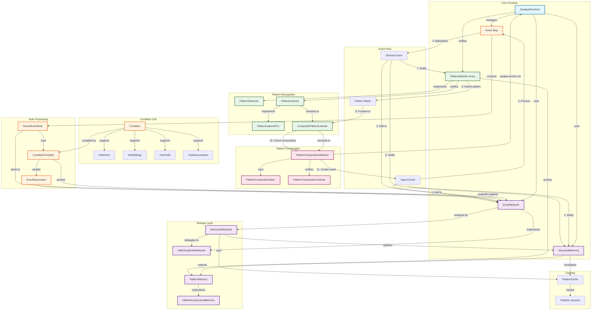

# Component relationships
### 1. Core runtime layer
   SynapseRuntime: orchestrates ingestion, rule processing, and pattern detection
   Manages: EventNetwork, StructuralMemory, Rules, PatternWatcher[]
### 2. Storage layer
   - EventNetwork: DAG interface for events and relationships
   - InMemoryEventNetwork: concrete implementation
   - MemoizedNetwork: caching wrapper around the base network
   - StructuralMemory: tracks structural changes and motif occurrences
   - PatternMemory: extends StructuralMemory with lineage signatures
### 3. Rule processing pipeline
   - DeriveEventRule: processes events and evaluates conditions
   - ConditionCompiler: compiles Condition DSL into EventExpression
   - EventExpression: evaluates conditions against the network
### 4. Pattern recognition pipeline
   - PatternWatcher: observes materialized events and detects repeating patterns
   - PatternListener: receives pattern match notifications
   - CompositePatternListener: forwards matches to multiple watchers
### 5. Pattern composition pipeline
   - PatternCompositionWatcher: detects when multiple patterns are recognized together
   - Uses Synapse.Ingest to create derived events when compositions are detected
### 6. Event flow
   - Event ingested → added to network
   - Memory notified → updates caches
   - Rules processed → conditions evaluated
   - Derived events materialized → added to network
   - Memory updated → pattern signatures computed
   - Pattern watchers notified → pattern detection
   - Pattern matches forwarded → composition checking
   -Composition events created → cycle repeats
   
This diagram shows the main components, their relationships, and the event processing flow through the system.

