# Event Ingest Activity Diagram

Activity diagram showing the event processing flow from ingestion:

```mermaid
flowchart TD
    Start([Start: Ingest Leaf Event]) --> AddToNetwork[Add Event to Network]
    AddToNetwork --> NotifyMemory[Notify Memory: OnEventAdded]
    NotifyMemory --> InitializeQueue[Initialize Processing Queue with Event]
    
    InitializeQueue --> CheckQueue{Queue Empty?}
    CheckQueue -->|No| DequeueEvent[Dequeue Event from Queue]
    CheckQueue -->|Yes| End([End])
    
    DequeueEvent --> GetRules[Get Rules for Event Type]
    GetRules --> CheckRules{Rules Exist?}
    CheckRules -->|No| CheckQueue
    CheckRules -->|Yes| ProcessRule[Process Next Rule]
    
    ProcessRule --> CompileCondition[ConditionCompiler: Compile Condition]
    CompileCondition --> CreateExpression[Create EventExpression]
    CreateExpression --> EvaluateCondition[Evaluate Expression against Network]
    
    EvaluateCondition --> ConditionMet{Condition Satisfied?}
    ConditionMet -->|No| CheckMoreRules{More Rules?}
    ConditionMet -->|Yes| MaterializeDerived[Materialize Derived Event]
    
    MaterializeDerived --> CreateEvent[Create Event from Template]
    CreateEvent --> AddDerivedToNetwork[Add Derived Event to Network]
    AddDerivedToNetwork --> AddEdges[Add Edges: Contributors -> Derived]
    AddEdges --> NotifyMemoryDerived[Notify Memory: OnMaterialized]
    
    NotifyMemoryDerived --> ComputeSignature[Memory: Compute Lineage Signature]
    ComputeSignature --> UpdateStats[Memory: Update Lineage Statistics]
    UpdateStats --> NotifyPatternWatchers[Notify PatternWatchers: OnMaterialized]
    
    NotifyPatternWatchers --> CheckWatchSpec{WatchSpec Allows Event?}
    CheckWatchSpec -->|No| CheckMoreRules
    CheckWatchSpec -->|Yes| GetSignature[Get Event Signature from Memory]
    
    GetSignature --> CheckMinCount{Count >= MinCount?}
    CheckMinCount -->|No| CheckMoreRules
    CheckMinCount -->|Yes| FirePatternMatch[Fire PatternMatch to Listener]
    
    FirePatternMatch --> NotifyListener[PatternListener: OnPatternRepeated]
    NotifyListener --> ForwardToComposite{CompositeListener?}
    ForwardToComposite -->|Yes| ForwardMatches[Forward to PatternCompositionWatchers]
    ForwardToComposite -->|No| CheckMoreRules
    
    ForwardMatches --> CheckComposition{Composition Conditions Met?}
    CheckComposition -->|No| CheckMoreRules
    CheckComposition -->|Yes| CreateCompositionEvent[Create Composition Event]
    
    CreateCompositionEvent --> IngestComposition[Ingest Composition Event via Synapse]
    IngestComposition --> AddToNetwork
    
    CheckMoreRules -->|Yes| ProcessRule
    CheckMoreRules -->|No| AddToQueue{Derived Events Created?}
    AddToQueue -->|Yes| EnqueueDerived[Enqueue Derived Events to Queue]
    EnqueueDerived --> CheckQueue
    AddToQueue -->|No| CheckQueue
    
    %% Styling
    classDef startEnd fill:#e1f5ff,stroke:#01579b,stroke-width:3px
    classDef process fill:#fff3e0,stroke:#e65100,stroke-width:2px
    classDef decision fill:#e8f5e9,stroke:#1b5e20,stroke-width:2px
    classDef memory fill:#f3e5f5,stroke:#4a148c,stroke-width:2px
    classDef pattern fill:#fce4ec,stroke:#880e4f,stroke-width:2px
    
    class Start,End startEnd
    class AddToNetwork,CreateEvent,AddDerivedToNetwork,AddEdges,CreateCompositionEvent,IngestComposition process
    class CheckQueue,CheckRules,ConditionMet,CheckMoreRules,CheckWatchSpec,CheckMinCount,ForwardToComposite,CheckComposition,AddToQueue decision
    class NotifyMemory,NotifyMemoryDerived,ComputeSignature,UpdateStats memory
    class NotifyPatternWatchers,GetSignature,FirePatternMatch,NotifyListener,ForwardMatches pattern
```

Flow explanation:
1. Entry point: Ingest leaf event
2. Storage: Add event to network and notify memory
3. Rule processing loop:
 - Dequeue event from queue
 - Get rules for event type
 - For each rule: compile condition → evaluate → check satisfaction
4. Derivation: If condition met, materialize derived event
5. Memory update: Compute lineage signatures and update statistics
6. Pattern detection: PatternWatchers check for repeating patterns
7. Pattern notification: If pattern detected, notify listeners
8. Composition: CompositeListener forwards to PatternCompositionWatchers
9. Composition detection: Check if composition conditions are met
10. Recursion: If composition detected, create new event (loops back to step 1)
11. Queue processing: Derived events are enqueued for further rule processing

>The diagram shows the main decision points and how the system processes events through rules, pattern detection, and composition recognition.