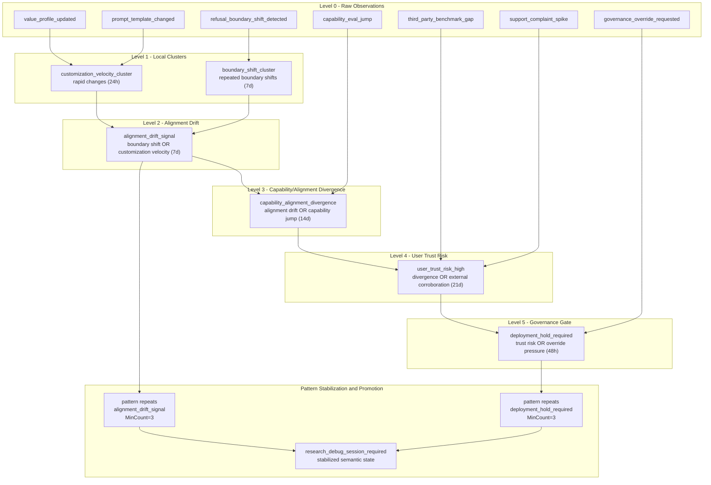

# Community Customization + Values → Drift → Research Debug Session (Stabilized)

## Walkthrough: Community Customization + Values → Drift → Research Debug Session (Stabilized)

Imagine a model customized for a specific community: the value rubric evolves, prompt templates change, and the system is intentionally flexible. The risk is not that change happens — the risk is that change becomes untracked semantic drift, where the boundary of what the model will do shifts faster than anyone can understand it.

SYNAPSE treats every change as a fact. Value profiles are updated and prompt templates iterate. Refusal-boundary drift is detected by deterministic evaluations. Capability evaluations jump. External benchmarks move. User complaints spike. None of these alone is a verdict. Instead, SYNAPSE constructs meaning bottom-up with time windows: rapid customization churn promotes a CustomizationVelocityCluster; repeated refusal shifts promote a BoundaryShiftCluster.

From there SYNAPSE builds higher meaning opportunistically: if either cluster appears near the other in a window, it promotes an AlignmentDriftSignal. If that drift appears near a capability jump, it promotes CapabilityAlignmentDivergence — a precise semantic statement that capability and alignment surface moved together. If divergence aligns with external benchmark gaps or user trust signals, it promotes UserTrustRiskHigh. If shipping pressure appears close to that risk (override requests), it promotes DeploymentHoldRequired — an explicit governance semantic state rather than an implicit threshold.

The key step is stabilization. SYNAPSE still does not declare “research escalation” on first sight. Only when the same drift-to-hold semantic ladder repeats across multiple episodes within a defined window does SYNAPSE promote a final, stabilized meaning: ResearchDebugSessionRequired. This event represents a deterministic “debug loop” trigger — not because a score crossed a line, but because recurring structure proved the drift is real.

This is the missing layer for customization at scale: meaning matures before it governs. Rules construct candidate meaning quickly; patterns stabilize meaning only after recurrence. The outcome is explainable, replayable, and suitable for research teams that want frontier systems to remain understood while still being customizable.

## Flowchart
