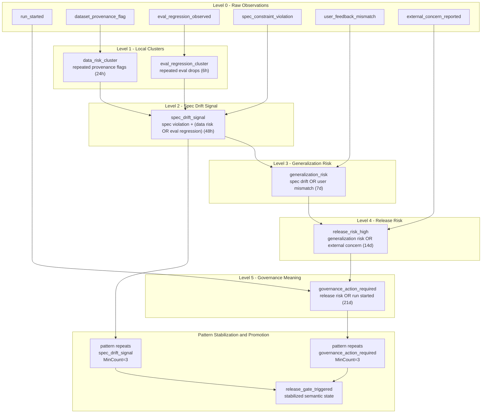

# Spec-locked fine-tune drift → Release Gate

## Walkthrough (Customization + Values → Drift Alarm → Research Debug Session):

Consider a spec-locked fine-tuning workflow where the “spec” is not a document, but a deterministic contract enforced by 
checks, evals, and constraints. Each training run produces raw, local facts: dataset slices are modified, provenance flags 
appear, eval regressions are observed, and explicit spec constraints are violated.

SYNAPSE does not wait for perfect evidence. It begins by constructing meaning opportunistically: repeated provenance flags 
form a DataRiskCluster, repeated eval drops form an EvalRegressionCluster, and any alignment between a spec violation and 
either cluster inside a time window promotes a SpecDriftSignal. 
>This is not a verdict — it is a hypothesis, recorded as structure.

As time passes, further signals accumulate. User feedback that contradicts expected behavior, or external concerns reported 
by partners, independently corroborate the drift and promote GeneralizationRisk and then ReleaseRiskHigh. If a training run 
exists in this lineage, SYNAPSE derives GovernanceActionRequired — a concrete semantic statement that this run can no longer 
be treated as routine.

## Flowchart

